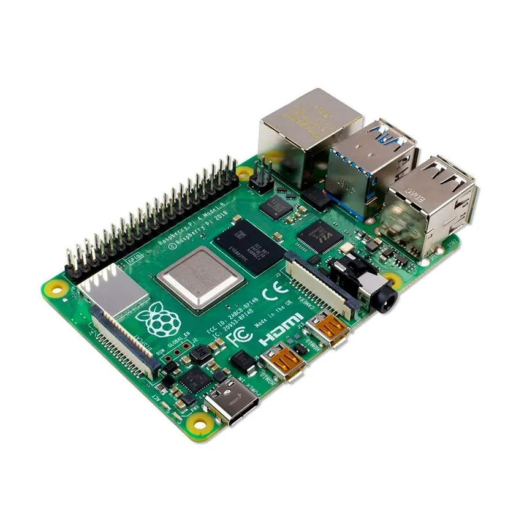
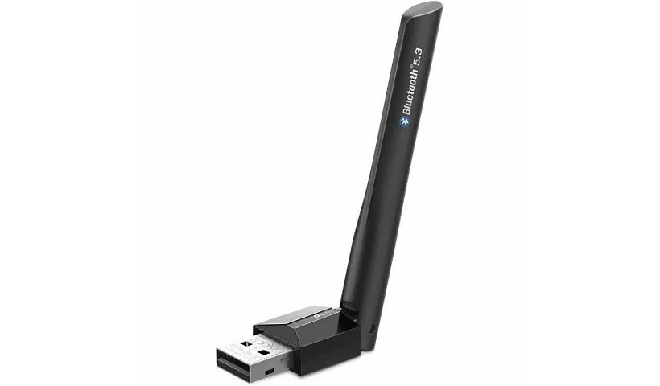
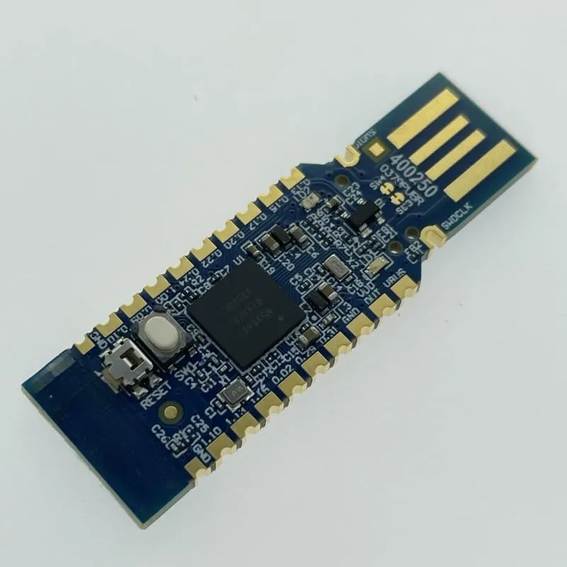
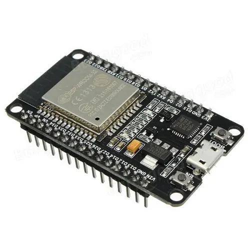

# blue-deauth v0.1.2-alpha

A small Bluetooth testing utility for resilience/security testing. This repository contains the original BLE deauthentication script plus additional notes and hardware recommendations for field testing. Intended for authorized security testing and research only.

## Quick summary
- Purpose: simple BLE stress/deauth tests (ping flood and RFCOMM connect flood).
- Use only on systems/networks you own or have explicit permission to test.


## Table of contents
- What this repo contains
- Quick usage
- Requirements
- Hardware Bill of Materials (BOM)
- Notes, minimal credits, license

## What this repo contains
- `blue_dos.sh` — main script to run BLE attack types (l2ping and rfcomm).
- README with hardware recommendations and usage examples (this file).

## Quick usage
Bluetooth deauthenticator v0.1.2-beta
Attack types:
  1) l2ping — Ping flood
  2) rfcomm — Connect flood

Usage:

```bash
bash blue_dos.sh <target_addr> <packet_size> <attack_type>
# examples
bash blue_dos.sh FC:58:FA:XX:XX:XX 600 1   # l2ping flood
bash blue_dos.sh FC:58:FA:XX:XX:XX 600 2   # rfcomm connect flood
```

## Requirements
- bluez utilities (includes `l2ping` and `rfcomm`) — available in most Linux distros (Kali, Debian, Ubuntu).

Notes:
- The script has been tested on Kali. It should work on other Linux distributions that use BlueZ.

## Hardware Bill of Materials (BOM) — Field testing setup (user additions)
These are suggestions for building a small test lab: an offensive node (tester), an analysis/watchdog node, and a target/prototype node.

1) Offensive Node (Tester)
- Primary host: Raspberry Pi 4 Model B (4GB or 8GB). Runs automated scripts and acts as an edge gateway.
  
- External Bluetooth dongle: Panda Wireless PAU09 or TP-Link UB500 (high-gain antenna) — using an external adapter avoids disconnecting internal Bluetooth devices; typically shows as `hci1`.
  

2) Analysis Node (Watchdog)
- Bluetooth sniffer: Nordic nRF52840 Dongle (budget) or Ubertooth One (pro). Use with Wireshark to inspect BLE packets.
  
- Software defined radio (SDR): RTL-SDR Blog V3 for spectrum analysis and jamming detection — useful when working with other radio technologies (LoRaWAN, 433MHz).
  [YouTube: Intro to RTL-SDR](https://www.youtube.com/watch?v=U-A7lEKm_vE)

3) Target Node (Prototype)
- ESP32 (ESP32-WROOM-32) — common IoT dev board for WiFi/Bluetooth testing. Program targets to detect flooding and implement self-healing (reboot/switch channel).
  
- Logic analyzer: Saleae Logic 8 or compatible clone for hardware-level debugging.
  

## Notes and safety
- This project is provided for research and authorized testing. Do not use it to interfere with others' devices or networks without permission.
- Consider using an external adapter (dongle) for the testing host to avoid disrupting your workstation.

## Minimal credits
- Original project: its0x08/blue-deauth — initial script and idea.
- This README includes additional hardware notes and suggestions added by the current repository owner for field testing and resilience work.

## License
See the `LICENSE` file in this repository for license details.

## Contributing
Pull requests and issues are welcome. Keep changes focused and clearly documented.

---
*Maintained for security testing and educational use.*
# Thanks I would like to  tell you that I have been looking for this
so I am going to manipulate this to be used for my adventure

# First of this is not a hacking tool ,It is Security & Resilience Testing Tool
here I am going to show you The hardware Bill of Material(BOM) and Tool List


##  1. The 'Offensive' Node (The Tester)

### The Primary Host: Raspberry Pi 4 Model B(4GB or 8GB RAM)
It acts as the "Edge Gateway" or "Field Testing Unit" that can run automated scripts (like your l2ping loop) 24/7.


Dependency: Standard Linux (Kali or Raspbian) runs the BlueZ stack natively.


### External Bluetooth Controller: Panda Wireless PAU09 or TP-Link UB500
High-gain external antenna for long-range connectivity testing.
Using an external dongle prevents you from accidentally disconnecting your own keyboard/mouse if they use the internal Bluetooth. It will likely appear as hci1


## 2. The "Analysis" Node (The Watchdog)
 you can "see" the invisible data and secure it.

### Bluetooth Sniffer: Nordic nRF52840 Dongle (Budget) or Ubertooth One (Pro)


Allows us to capture and analyze airborne packets to ensure our cow trackers are not leaking sensitive location data.

Use: Works with Wireshark to visualize the packets your script is sending.

### Software Defined Radio (SDR): RTL-SDR Blog V3

 Spectrum analysis to detect signal jamming

Relevance: Essential for debugging LoRaWAN or 433MHz signals 
[Youtube video for Guidance](https://www.youtube.com/watch?v=U-A7lEKm_vE)


## 3. The "Target" Node (The Prototype)


Microcontroller: ESP32 Development Board (ESP32-WROOM-32)
The industry standard for WiFi/Bluetooth IoT. It is cheap, powerful, and robust.

Role: This is the device receiving your "attacks." You will program it to detect when it is being flooded and automatically reboot or switch channels (a "Self-Healing" feature).


Logic Analyzer: Saleae Logic 8 (or a generic 24MHz 8-channel clone)
"Deep hardware debugging to verify chip-to-chip communication stability under stress."


# Bluetooth deauthenticator - blue-deauth v0.1.2-alpha
A simple script that makes possible BLE deauthentication!


[](https://github.com/its0x08/blue-deauth/actions/workflows/semgrep.yml)
[](https://github.com/its0x08/blue-deauth/actions/workflows/codacy.yml)

### Simple usage
```bash
Bluetooth deauthenticator v0.1.2-beta
Attack types:
        1.) l2ping - Ping flood
        2.) rfcomm - Connect flood

 [i] Usage: blue_dos.sh <target_addr> <packet_size> <attack_type>
root@kali:/scripts/blue-deauth# bash blue_dos.sh FC:58:FA:XX:XX:XX 600 1
root@kali:/scripts/blue-deauth# bash blue_dos.sh FC:58:FA:XX:XX:XX 600 2
```

### Requirements:
```
l2ping (comes with bluez)
rfcomm (comes with bluez)
```

### Tested only in Kali but any Linux OS that uses bluez should work.
---
## Pull requests and issues are welcome!


